# **Работа с СКВ git**
## *Часть 1 (семинар 1)*
(базовая работа в git)
В данном разделе будет рассмотрена базовая работа в локальных репозиториях ***Git***.
## **Просмотр настроек git**
Чтобы посмотреть все установленные настройки и узнать где именно они заданы, используйте команду:

    $ git config --list --show-origin
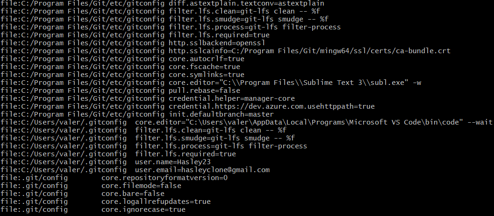

## **Имя пользователя**
Первое, что вам следует сделать после установки Git — указать ваше имя и адрес электронной почты. Это важно, потому что каждый коммит в Git содержит эту информацию, и она включена в коммиты, передаваемые вами, и не может быть далее изменена:

    $ git config --global user.name "John Doe"
    $ git config --global user.email johndoe@example.com
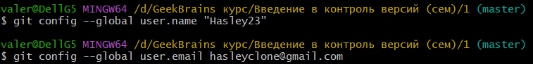

## **Создание репозитория (repo)**
Репозиторий СКВ (Система Контроля Версий) - это место, где хранятся и поддерживаются какие-либо данные.
Для того, чтобы делать это, необходимо создать новый репозиторий. Делается это с помощью команды:

    $ git init
    $ git config --global user.email johndoe@example.com
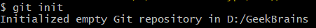

## **Добавление файлов для отслеживания**
По умолчанию git не отслеживает файлы. Для их отслеживания необходимо добавить файлы в список отслеживания командой:

    $ git add filename.extension
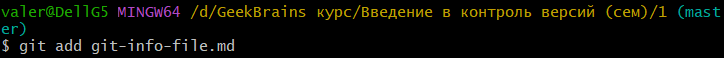

Если добавлять файлы таким образом, то только в небольшом количестве. Для добавления сразу всех файлов, необходимо воспользоваться звездочкой (*).

    $ git add *
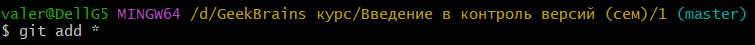

## **Фиксация изменений (commit)**
Чтобы зафиксировать сохранённые изменения, используйте команду:

    $ git commit -m "msg"

, где "msg" - краткое описания изменения.
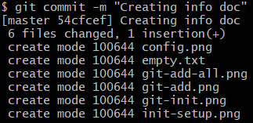

Для фиксации изменений необязательно добавлять измененные файлы к отслеживанию, однако новые файлы всегда нужно добавлять. Автоматическое добавление измененных файлов произойдет в момент выполнения команды (фиксирование с * или с ключом -a, --all):

    $ git commit -a -m "commiting automated"
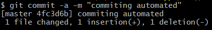

Файлы, которые не были добавлены в отслеживание:
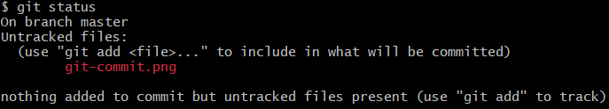

## **Просмотр разницы между двумя git деревьями**
Команда git diff используется для вычисления разницы между любыми двумя Git деревьями. Это может быть разница между вашей рабочей копией и индексом (собственно *git diff*), разница между индексом и последним коммитом (*git diff --staged*), или между любыми двумя коммитами (*git diff master branchB*).

    $ git diff hash
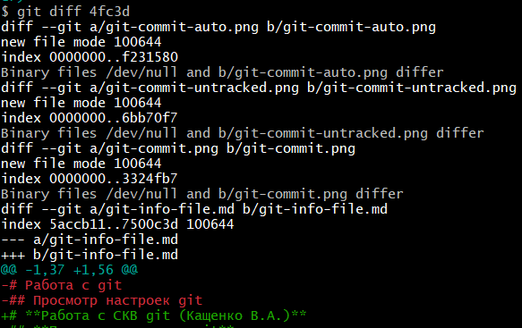
## **Главные шаги для работы с git**
Для успешной работы с СКВ git необходимо соблюдать 4 главных шага:
1. Изменение/добавление файлов
2. Сохранение изменений (шорткат *Ctrl + S*)
3. Добавление файлов к отслеживанию (команда *git add*)
4. Фиксация изменений (команда *git commit*)

## *Часть 2 (семинар 2)*
(работа с ветками)
В данном разделе будет расмотрена работа с ветвлением в локальных репозиториях ***Git***.
### **Просмотр существующих веток**
Для просмотра набора имеющихся веток необходимо воспользоваться командой:

    $ git branch
### **Создание веток**
Для создания ветки необходимо воспользоваться командой:

    $ git branch "Branch name"

### **Переход на различные существующие ветки**
Для перехода с основной ветки (*master*) на другую необходимо воспользоваться командой:

    $ git checkout branch_name
### **Слияние веток**
**Слияние веток** – это перенос изменений с одной ветки на другую. При этом слияние не затрагивает сливаемую ветку, то есть она остается в том же состоянии, что позволяет нам потом продолжить работу с ней.
Для слияния веток необходимо выполнить команду:

    $ git merge branch_name

При этом слияние выполняется из той ветки, в которую выполняется это слияние.
#### **Явное слияние**

    Перед слиянием веток необхожиимо убедиться в том, 
    что базовая ветка и принимаемая указаны верноно!

Во время явного слияния создается так называемый *merge-коммит*. Основное предназначение этого коммита состоит в том, чтобы *"соединить"* изменения двух веток. У этого коммита есть одна *особенность: два родительских коммита.* Один родитель – последний коммит сливаемой ветки, второй – последний коммит целевой ветки.
Допустим, у нас есть граф вида:
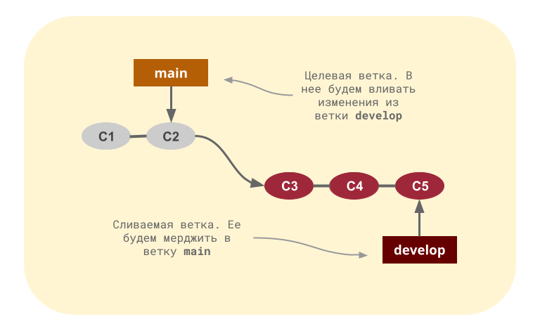
То есть у нас есть две ветки: **main** – основная и **develop** – ветка для разработки новых функций. Слияние в **main**:

    $ git checkout main
    $ git merge --no-ff develop

Флаг --no-ff (*no fast forvard*) в данной ситуации необходим, поскольку мы хотим выполнить именно явное слияние.

#### **Неявное слияние**
Во время неявного слияния *не создается новых коммитов*: используются только уже существующие. Суть этого слияния заключается в том, что из вливаемой ветки извлекаются несколько коммитов, а затем они применяются к последнему коммиту целевой ветки. Такое слияние называется **fast-forward**.
    
    $ git checkout main
    $ git merge develop
Давайте рассмотрим пример. Допустим, у нас есть все тот же граф репозитория:
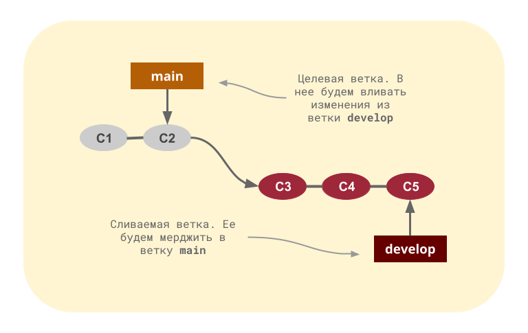
Тогда git merge поступит так:
    1. Проверит, что в ветке main нет коммитов, сделанных после ответвления develop.
    2. Проверит, что не возникает конфликтов, если конфликты возникнут, Git попросит пользователя разрешить их.
    3. Перенесет указатель main на Commit-5. Теперь ветка develop как бы стала веткой main.

### **Конфликты**
Конфликты разрешаются с момент возникновения.
Есть несколько шагов, которые могут сократить количество шагов, необходимых для разрешения конфликтов слияния в Git:
1. Самый простой способ разрешить конфликтующий файл — открыть его и внести необходимые изменения.
2. После редактирования файла мы можем использовать команду *git add* для подготовки нового объединенного содержимого.
Последний шаг — создать новую фиксацию с помощью команды *git commit*.
3. Git создаст новую фиксацию слияния, чтобы завершить слияние.

### **Конфликты git в vs code**
При работе в **VSC** с **git** очень удобно разрешать конфликтные ситуации.
При возникновении конфликта появляется графическое отображение конфликтующих изменений.
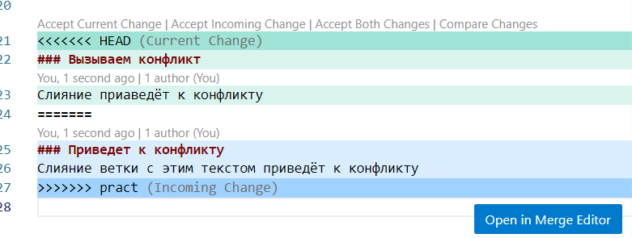

## *Часть 3 (семинар 3)*
(Взаимодействие с GitHub)
В данном раздеел будет рассмотрено взаимодействие *локального* репозитория и *удаленного* в ***GitHub***.

### **Создание удаленного репозитория**
(Способ не единственный, но рабочий)
Для создания удаленного репозитория необходимо совершить ряд шагов:
1. Инициализировать репозиторий (локально)
2. В GitBash ввести:

    $ ssh-keygen.exe
3. Нажимать **Enter** в ответ на просьбы о вводе чего-либо.
4. Ввести команду просмотра ssh-ключа и скопировать его:

    $ ~/.ssh/id_rsa.pub
5. На сайте GitHub (https://github.com/) войти, войти в настройки (Settings)
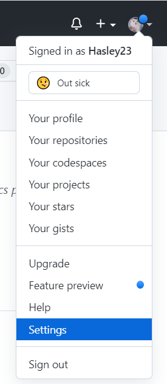
6. Создать новый ключ и вставить сгенерированный:
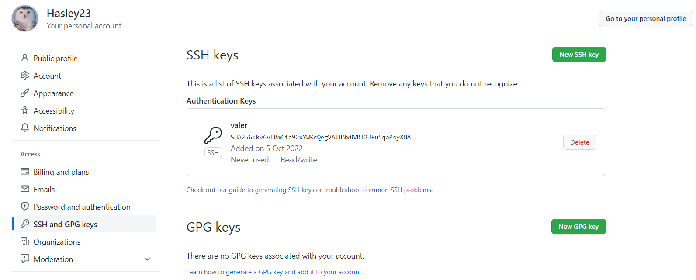
7. Теперь привязка выполнена и можно делать *git pull* и *git push*.

Если не делать подобную привязку, то при выполнении команды взаимодействия с репозиторием нужно будет вводить пароль от аккаунта, email которого был привязан в **Git**.

### **Создание ответвления чужого репозитория**
На сайте **GitHub** найденный репозиторий можно позаимствовать (*fork*) и помочь разработке, отправив соответствующий запрос (*pull request*):
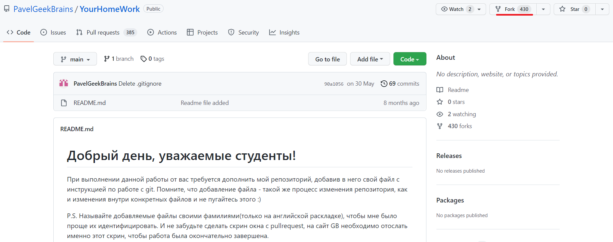
Далее необходимо ввести данные и после этого в аккаунт добавится собственный репозиторий-ответвление:
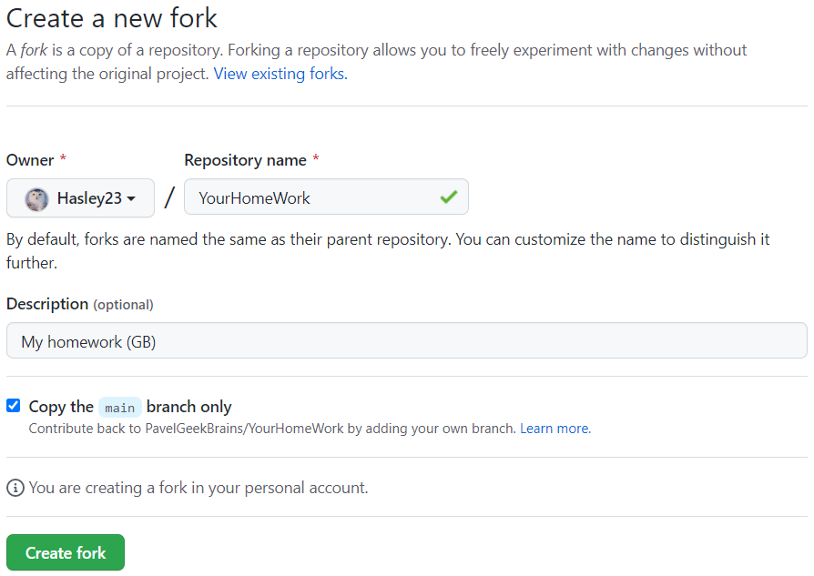
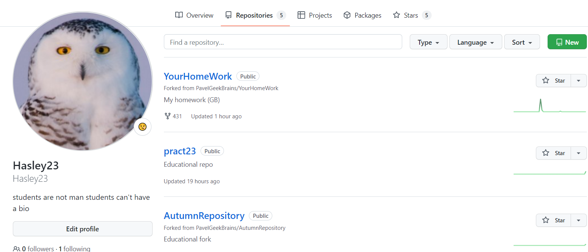
Далее нужно склонировать репозиторий локально и создать другую, отличную от *main* ветку (*так принято*):
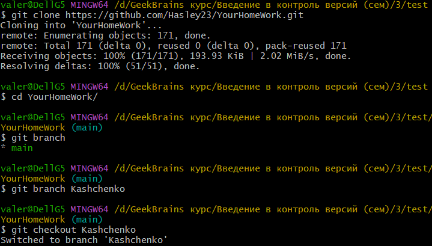
После работы с "форкнутым" репозиторием необходимо сделать предложение изменения кода в чужом репозитории (*pull request*):
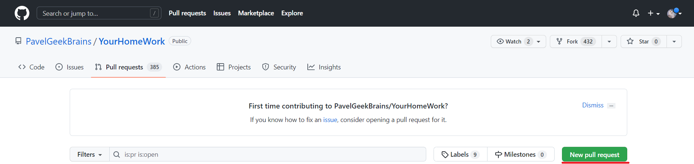